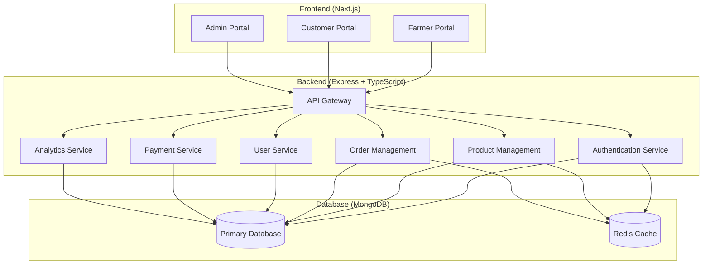
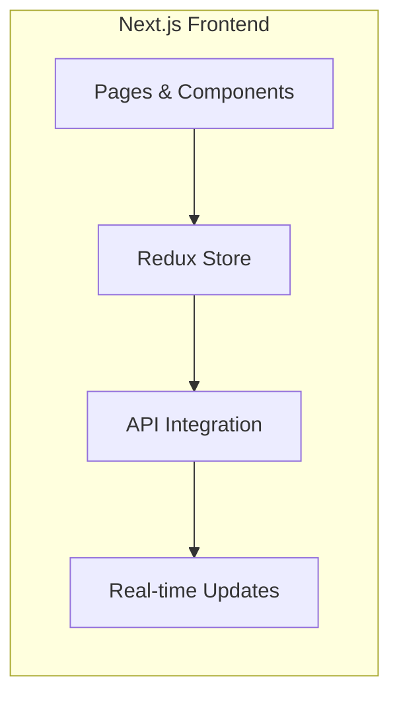
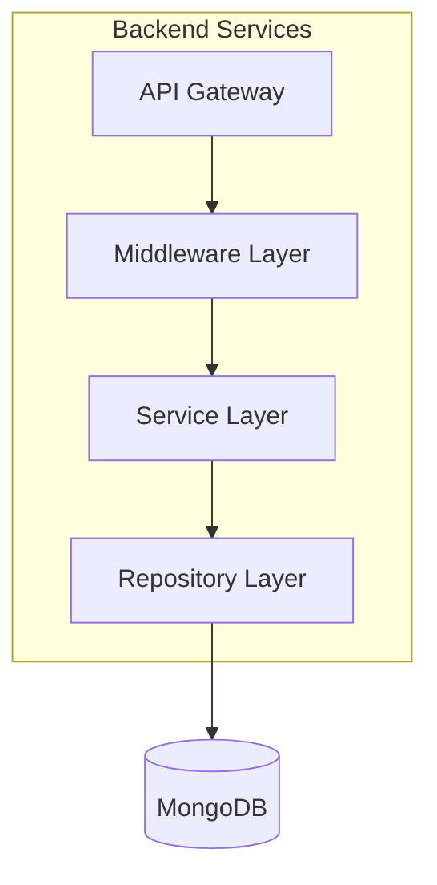
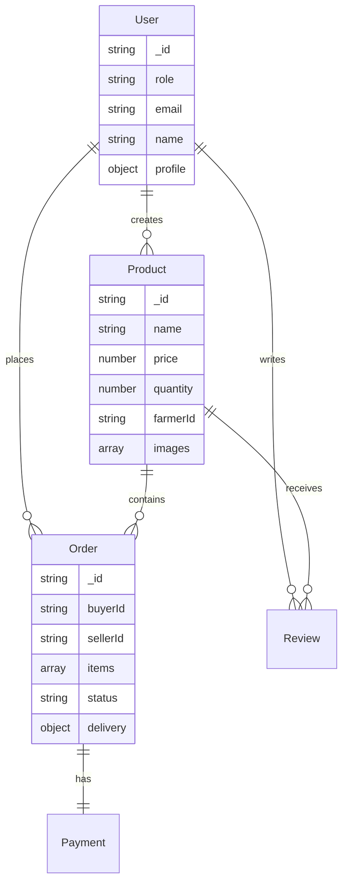

# Farmer's Marketplace Platform - Architectural Plan

## 1. System Architecture

## 2. Module Features

### 2.1 Farmer Portal
- **Product Management**
  - Create/edit product listings
  - Manage inventory levels
  - Set pricing and discounts
  - Upload product images
  
- **Order Management**
  - View and process orders
  - Update order status
  - Manage delivery details
  
- **Business Analytics**
  - Sales dashboard
  - Revenue tracking
  - Customer insights
  - Inventory analytics
  
- **Account Management**
  - Profile management
  - Bank/payment information
  - Store settings

### 2.2 Customer Portal
- **Shopping Experience**
  - Product browsing with search/filters
  - Shopping cart functionality
  - Wishlist/saved sellers
  - Product reviews and ratings
  
- **Order Management**
  - Order placement and tracking
  - Order history
  - Delivery status updates
  - Return/refund requests
  
- **User Features**
  - User profile
  - Multiple delivery addresses
  - Payment methods management
  - Review management

### 2.3 Admin Portal
- **User Management**
  - User registration approval
  - User role management
  - Account suspension/deletion
  
- **Content Management**
  - Product moderation
  - Review moderation
  - Category management
  
- **System Management**
  - Transaction monitoring
  - Dispute resolution
  - System configuration
  - Payment gateway settings
  
- **Analytics & Reporting**
  - Sales analytics
  - User analytics
  - Financial reports
  - Platform performance metrics

## 3. Technical Implementation

### 3.1 Frontend (Next.js)

- **Technology Stack**
  - Next.js 14+ with App Router
  - TypeScript
  - Redux Toolkit for state management
  - TailwindCSS for styling
  - Socket.io for real-time features

### 3.2 Backend (Express + TypeScript)

- **Technology Stack**
  - Express.js with TypeScript
  - MongoDB with Mongoose ODM
  - Redis for caching
  - JWT for authentication
  - Socket.io for real-time features

### 3.3 Database Schema (MongoDB)

## 4. Security & Performance Considerations

### 4.1 Security
- JWT-based authentication
- Role-based access control (RBAC)
- Input validation and sanitization
- API rate limiting
- Data encryption at rest and in transit

### 4.2 Performance
- Redis caching for frequently accessed data
- Image optimization and CDN usage
- Database indexing
- API response pagination
- Lazy loading of components

## 5. Development Phases

1. **Phase 1: Core Features** (4-6 weeks)
   - Basic authentication
   - Farmer product management
   - Customer shopping experience
   - Admin user management

2. **Phase 2: Enhanced Features** (4-6 weeks)
   - Payment integration
   - Order management
   - Reviews and ratings
   - Basic analytics

3. **Phase 3: Advanced Features** (4-6 weeks)
   - Real-time notifications
   - Advanced analytics
   - Mobile responsiveness
   - Performance optimizations